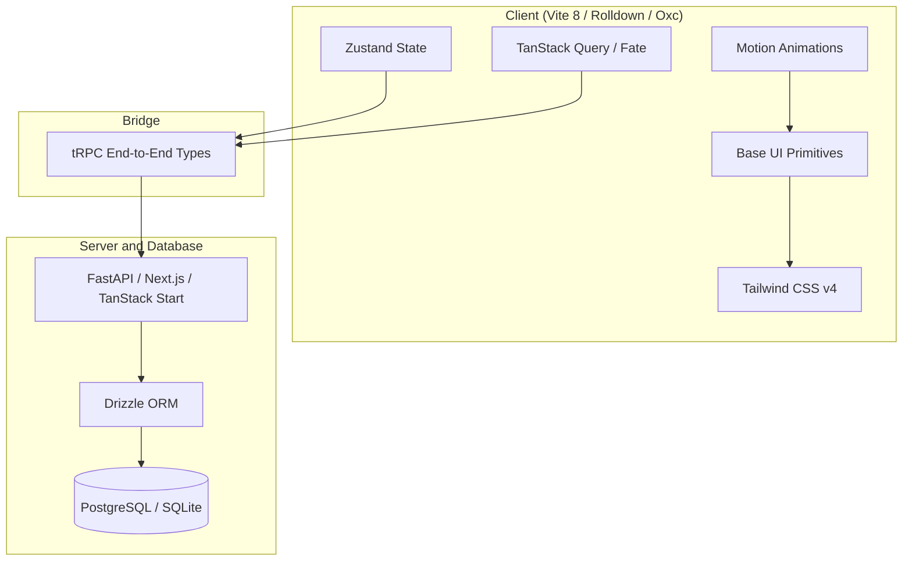

# Modern Web Stack Developer Guide (2026 Edition)

This guide documents the recommended greenfield architecture stack optimized for high-performance React applications, developer velocity, and seamless AI-assisted code generation.

---

## 🚀 Optimized Stack Architecture

---

## 1. Metaframework
* **Default Recommended**: **Next.js** or **TanStack Start**
* **The Nuance**: While Next.js remains the industry standard, **TanStack Start** (powered by Nitro and Vite 8) provides unparalleled native TypeScript safety across the network boundary using type-safe loaders and actions. This dramatically reduces syntax errors generated by AI systems.

---

## 2. Bundling & Tooling
* **Default Recommended**: **Vite 8** (with **Rolldown** + **Oxc**) + **oxlint**
* **The Nuance**: Vite 8 uses Rolldown (Rust-based) for lightning-fast compilation. Combined with **oxlint**, linting happens in milliseconds on every file save, replacing legacy ESLint setups and keeping builds fast.

---

## 3. State Management
* **Default Recommended**: **Zustand** (Global State) + **TanStack Query / Fate** (Server Cache)
* **The Nuance**: Zustand replaces Redux for greenfield apps because it removes boilerplate (slices, actions, thunks). This makes it highly readable and clean for both developers and AI assistants.

---

## 4. UI Foundation & Styling
* **Default Recommended**: **Base UI** primitives styled with **Tailwind CSS v4**
* **The Nuance**: **Base UI** provides unstyled accessibility primitives (dialogs, select, popovers). Styling them with **Tailwind CSS v4** (which utilizes a Rust compiler and does not require PostCSS) provides 100% design fidelity without unnecessary CSS weight.

---

## 5. Animation
* **Default Recommended**: **Motion** (formerly Framer Motion)
* **The Nuance**: Motion has trimmed down to a lightweight core with support for native CSS animations, making it the preferred package for layout animations in React.

---

## 6. Backend-Frontend Bridge & Database
* **Default Recommended**: **Drizzle ORM** + **tRPC**
* **The Nuance**: **Drizzle ORM** provides type-safe SQL mappings suitable for serverless/edge runtimes, and when paired with **tRPC**, exposes backend endpoints directly as type-safe functions to the React frontend.
